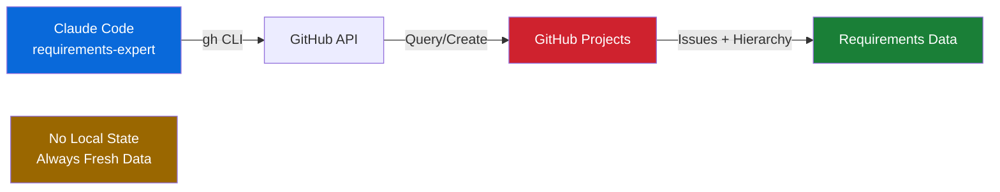

# Requirements Expert Plugin for Claude Code

[](https://opensource.org/licenses/MIT)
[](https://github.com/sjnims/requirements-expert/releases)
[](https://github.com/sjnims/requirements-expert/issues)
[](https://github.com/sjnims/requirements-expert/actions/workflows/markdownlint.yml)

A comprehensive requirements management plugin that guides users through the full requirements lifecycle using GitHub Projects for complete traceability and collaboration.

## Overview

The Requirements Expert plugin helps you transform vague ideas into fully-structured, actionable requirements using a proven methodology:

> Vision → Epics → User Stories → Tasks

Everything is managed in GitHub Projects with full parent/child hierarchy, making your entire product roadmap visible and trackable in one place.

## Features

- **Interactive Discovery**: Guided Q&A sessions for each phase using best practices
- **Full Lifecycle Support**: Vision → Epics → Stories → Tasks with feedback loops
- **GitHub Projects Integration**: All requirements stored as GitHub issues in GitHub Projects with true hierarchy
- **MoSCoW Prioritization**: Built-in prioritization framework at every level
- **Automated Validation**: Quality checks for completeness, consistency, and best practices
- **Workflow Orchestration**: Seamlessly move from one phase to the next with guided automation

## Prerequisites

- **Claude Code**: Install from [claude.ai/code](https://claude.ai/code)
- **GitHub CLI** (`gh`): Installed and authenticated (`gh auth login`)
- **Git repository**: A GitHub repository where you want to track requirements
- **GitHub permissions**: `repo` and `project` scopes (read/write)

Verify setup:
```bash
gh auth status  # Should show ✓ Logged in and list scopes
```

## Installation

### Local Development

```bash
# Clone the repository
git clone https://github.com/sjnims/requirements-expert.git
cd requirements-expert

# Load the plugin (note: plugin root is in plugins/ subdirectory)
cc --plugin-dir plugins/requirements-expert
```

### From Marketplace

**Note:** This plugin is currently distributed via GitHub. Marketplace publishing is planned for future releases.

## Quick Start

### 1. Initialize a New Project

```
/re:init
```

Creates a GitHub Project for your repository with custom fields (Type, Priority, Status) and configures project views.

### 2. Discover Your Vision

```
/re:discover-vision
```

Interactive Q&A session that helps you articulate:
- Problem statement
- Target users
- Success metrics
- Core value proposition

Creates a Vision issue in your GitHub Project.

### 3. Identify Epics

```
/re:identify-epics
```

Analyzes your vision and guides you through identifying major features/capabilities. Creates Epic issues as children of the Vision issue.

### 4. Create User Stories

```
/re:create-stories
```

Select an epic and break it down into user stories following INVEST criteria. Creates Story issues as children of the Epic.

### 5. Define Tasks

```
/re:create-tasks
```

Break a story into concrete tasks with acceptance criteria. Creates Task issues as children of the Story.

### 6. Prioritize

```
/re:prioritize
```

Use MoSCoW framework (Must/Should/Could/Won't) to prioritize at any level.

### 7. Review & Validate

```
/re:review
```

Runs automated validation checks:
- Completeness (all required sections present)
- Consistency (proper linking, no orphans)
- Quality (INVEST criteria for stories, clear acceptance criteria)
- Traceability (vision → epic → story → task chain)

### 8. Check Status

```
/re:status
```

View project overview:
- Counts by type (X epics, Y stories, Z tasks)
- Completion status
- Validation results
- Recent activity

## GitHub Projects Structure

All requirements are stored as GitHub issues in GitHub Projects with this hierarchy:

```
📋 Vision (Issue, Type: Vision)
  ├── 🎯 Epic 1 (Child Issue, Type: Epic)
  │   ├── 📝 Story 1 (Child Issue, Type: Story)
  │   │   ├── ✅ Task 1 (Child Issue, Type: Task)
  │   │   └── ✅ Task 2 (Child Issue, Type: Task)
  │   └── 📝 Story 2 (Child Issue, Type: Story)
  │       └── ✅ Task 3 (Child Issue, Type: Task)
  └── 🎯 Epic 2 (Child Issue, Type: Epic)
      └── 📝 Story 3 (Child Issue, Type: Story)
          └── ✅ Task 4 (Child Issue, Type: Task)
```

### Custom Fields

- **Type**: Vision | Epic | Story | Task
- **Priority**: Must Have | Should Have | Could Have | Won't Have
- **Status**: Not Started | In Progress | Completed

### Labels

- `priority:must-have`, `priority:should-have`, `priority:could-have`, `priority:wont-have`
- `type:vision`, `type:epic`, `type:story`, `type:task`

## Architecture & Design Philosophy

### GitHub as the Source of Truth

This plugin follows a **stateless architecture** where GitHub Projects is the single source of truth:

**What this means:**

- ✅ All requirements data lives in GitHub Issues and Projects
- ✅ No local files or cached state (no `.local.md` files)
- ✅ Commands always query GitHub directly for current state
- ✅ Works identically across all machines and team members

**Why this design?**

1. **Real-time accuracy**: Always reflects current project state
2. **Team collaboration**: Everyone sees the same data
3. **Multi-machine**: Use the plugin from any machine without sync
4. **No conflicts**: No local state means no merge/sync issues
5. **GitHub native**: Leverage GitHub's collaboration features fully

**Data Flow:**



**Flow explanation:**

- `/re:*` commands use GitHub CLI (`gh`)
- CLI talks to GitHub API
- Data stored in GitHub Projects (Issues with parent/child links)
- **No local cache** - always queries GitHub for current state

This design ensures that all team members always see the same, up-to-date requirements without manual synchronization.

## Usage Examples

### Example 1: Starting from Scratch

```
User: "I'd like to build a web app that helps users track their fitness goals"

→ requirements-assistant agent detects this and suggests the plugin
→ User accepts, agent runs /re:init
→ Project created
→ Agent runs /re:discover-vision
→ Interactive Q&A creates Vision issue
→ Agent asks: "Continue to identify epics?"
→ User: "Yes"
→ Agent runs /re:identify-epics
→ ... continues through the lifecycle
```

### Example 2: Continuing from a Specific Phase

```
User: "I have a vision defined, need help identifying epics"

→ requirements-assistant detects this
→ Agent runs /re:review to validate existing vision
→ If valid, runs /re:identify-epics
→ If issues found, suggests fixing them first
```

### Example 3: Iterating on Existing Work

```
User: "I need to add another epic to my project"

→ User runs /re:identify-epics
→ Command detects existing epics
→ Offers to add new epic or refine existing ones
→ Creates new epic as child of Vision issue
```

## Commands Reference

| Command | Description |
|---------|-------------|
| `/re:init` | Initialize GitHub Project with custom fields |
| `/re:discover-vision` | Interactive vision discovery session |
| `/re:identify-epics` | Identify and create epic issues |
| `/re:create-stories` | Break epic into user stories |
| `/re:create-tasks` | Break story into tasks with acceptance criteria |
| `/re:prioritize` | Prioritize requirements using MoSCoW |
| `/re:review` | Validate requirements for quality and completeness |
| `/re:status` | Show project overview and status |

## Skills

The plugin includes six specialized skills that provide methodology and best practices. Skills are **automatically activated** when Claude Code detects relevant context in your conversation:

1. **vision-discovery** - How to discover and document product vision
2. **epic-identification** - How to identify and define epics from vision
3. **user-story-creation** - How to write effective user stories (INVEST criteria)
4. **task-breakdown** - How to decompose stories into tasks with acceptance criteria
5. **prioritization** - MoSCoW prioritization framework
6. **requirements-feedback** - Continuous feedback and iteration practices

Each skill provides structured guidance, templates, and best practices to ensure high-quality requirements at every level.

## Agents

### requirements-assistant

Proactively detects when you're working on requirements and offers help. Orchestrates the workflow by:
- Detecting requirements-related queries in your messages
- Suggesting appropriate commands based on context
- Automatically chaining phases (vision → epics → stories → tasks)
- Validating each phase before proceeding

### requirements-validator

Validates requirements documents for:
- **Completeness**: All required sections present
- **Consistency**: Proper linking between levels
- **Quality**: INVEST criteria for stories, clear acceptance criteria
- **Traceability**: Complete chain from vision to tasks

## Methodology

This plugin follows an Agile-inspired requirements methodology:

### Vision

The high-level product vision answering:
- What problem are we solving?
- Who are we solving it for?
- What does success look like?

### Epics

Major capabilities or features that:
- Deliver significant value
- Are too large for a single iteration
- Align with the vision

### User Stories

Specific user-facing functionality following INVEST criteria:
- **I**ndependent: Can be developed separately
- **N**egotiable: Details can be discussed
- **V**aluable: Delivers user value
- **E**stimable: Size can be estimated
- **S**mall: 1-5 days of work
- **T**estable: Can be verified

Format: "As a [user], I want [goal] so that [benefit]"

Each story requires 3-5 acceptance criteria that define testable completion conditions.

### Tasks

Concrete implementation steps with:
- Clear, actionable description
- 2-8 hours of work (up to 1-2 days maximum)
- 3-5 acceptance criteria (testable conditions)
- Dependencies identified
- Organized by layer: frontend, backend, data, testing, documentation

## Configuration

The plugin requires minimal configuration and auto-detects most settings:

### GitHub Repository

Auto-detected from `git remote` in your current directory when running commands.

**Requirements**: You must run Claude Code from within a git repository that has a GitHub remote configured.

### GitHub Authentication

Uses GitHub CLI (`gh`) authentication. Verify you're logged in:

```bash
gh auth status  # Should show logged in with 'repo' and 'project' scopes
```

If not authenticated or missing scopes:
```bash
gh auth login              # Initial authentication
gh auth refresh -s project # Add project scope if needed
```

### Project Name

Auto-generated from repository name during `/re:init`, or you can specify a custom name when prompted.

## Troubleshooting

### "GitHub CLI not found"

Ensure `gh` is installed and in your PATH:

```bash
brew install gh  # macOS
gh auth login
```

### "Insufficient permissions"

The plugin requires these GitHub permissions:
- `repo` - To create and manage issues
- `project` - To create and manage projects

Check with:
```bash
gh auth status
```

Re-authenticate if needed:
```bash
gh auth refresh -s project
```

### "Project not found"

Run `/re:init` to create the project, or ensure the project exists in your repository.

### "Cannot create child issues"

GitHub Projects (the new version) is required for parent/child relationships. Ensure:
1. You're using the new GitHub Projects, not classic projects
2. Your repository has Projects enabled
3. You have write access to the project

**Note**: Classic GitHub Projects do not support parent/child issue relationships. You must use the newer GitHub Projects (sometimes called "Projects Beta" or just "Projects").

## Best Practices

1. **Start with Vision**: Always begin with `/re:discover-vision` to establish clear direction
2. **One Epic at a Time**: Fully flesh out one epic before moving to the next
3. **Keep Stories Small**: User stories should be 1-5 days of work (INVEST criteria)
4. **Clear Acceptance Criteria**: Every story and task needs 3-5 testable acceptance criteria
5. **Regular Review**: Run `/re:review` frequently to catch issues early
6. **Prioritize Often**: Use `/re:prioritize` at each phase to focus on high-value work
7. **Iterate**: Use the feedback loops to refine requirements as you learn

## Contributing

Contributions welcome! Please:
1. Fork the repository
2. Create a feature branch
3. Test your changes locally with `cc --plugin-dir plugins/requirements-expert`
4. Ensure commands, skills, and agents follow the existing patterns (see CLAUDE.md)
5. Submit a pull request with a clear description of changes

## Acknowledgments

This project wouldn't exist without the incredible work of others:

- **[Claude](https://claude.ai)** - The AI assistant that helped design, build, and refine every aspect of this plugin. From architecture decisions to documentation, Claude was a true collaborator throughout.

- **[Anthropic](https://anthropic.com)** - For creating Claude and [Claude Code](https://claude.ai/code), the powerful AI coding assistant that makes plugins like this possible.

- **[GitHub](https://github.com)** - For GitHub Projects (the backbone of this plugin's data architecture), GitHub CLI, and GitHub Actions that power our CI/CD.

- **Open Source Tools** - The quality tools that keep this project maintainable:
  - [markdownlint](https://github.com/DavidAnson/markdownlint) for consistent documentation
  - [lychee](https://github.com/lycheeverse/lychee) for link validation
  - [actionlint](https://github.com/rhysd/actionlint) for workflow validation

## License

[MIT License](LICENSE.txt)

## Support

- **Issues**: [GitHub Issues](https://github.com/sjnims/requirements-expert/issues)
- **Discussions**: [GitHub Discussions](https://github.com/sjnims/requirements-expert/discussions)

## Changelog

See [CHANGELOG.md](CHANGELOG.md) for detailed release history.
